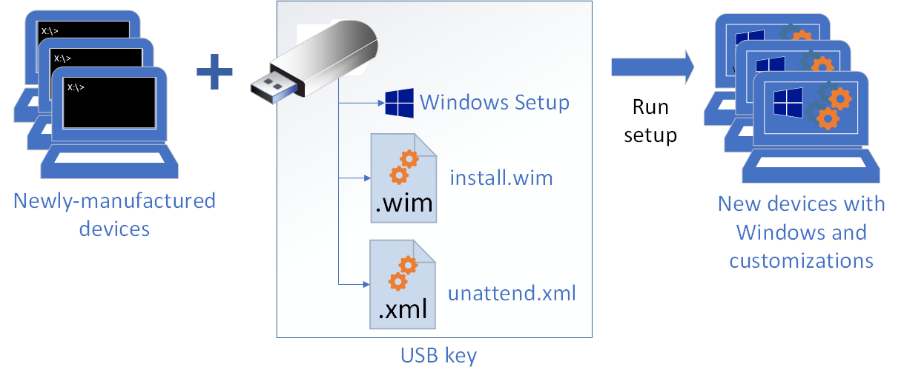

# Understanding servicing strategies

You can service, or make changes to, a Windows image in different ways:

## Online servicing

Update Windows from a familiar Windows environment. Apply your Windows image to a new reference device, and boot it into the built-in administrator account (audit mode). From here, you can add drivers, apps, and customizations. When you're done, prepare (generalize) the device and capture a new image file that can be applied to new devices. 

To learn more, see [Audit mode overview](audit-mode-overview.md).

## Offline servicing

To make faster changes to your images, you can make changes to the image without ever booting it. With the DISM tool, you can mount your image to a temporary location, install apps, drivers, languages, and more, and then commit the changes so they can be applied to new devices. DISM works from an elevated command-line or from PowerShell, which makes it easier to automate your changes with scripts.

To learn more, see [Mount and modify a Windows image using DISM](mount-and-modify-a-windows-image-using-dism.md).

## Servicing an image by using Windows Setup

During final deployment, you can use Windows Setup, plus a customized answer file (unattend.xml), to make final modifications.

To learn more, see [Windows Setup automation overview](windows-setup-automation-overview.md).

## Related topics

[Deployment Image Servicing and Management (DISM) Best Practices](deployment-image-servicing-and-management--dism--best-practices.md)

[DISM - Deployment Image Servicing and Management Technical Reference for Windows](dism---deployment-image-servicing-and-management-technical-reference-for-windows.md)
